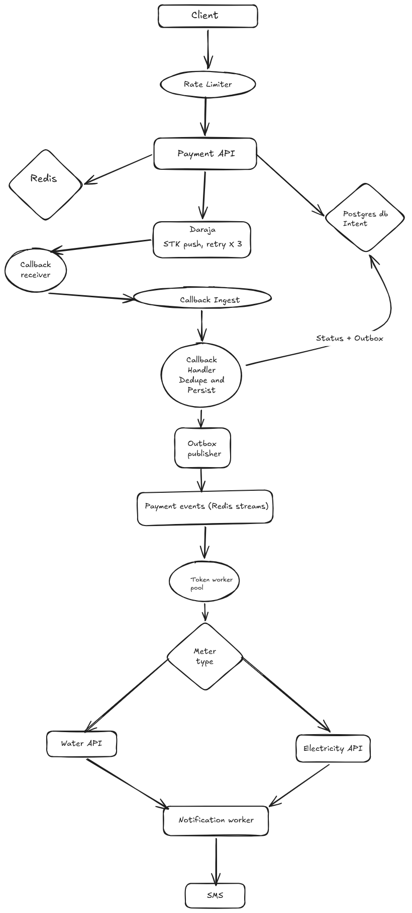

# UTILITY PAYMENTS PLATFORM: ARCHITECTURAL DESIGN DOCUMENT
This is a system that lets customers pay for basic utilities like water and electricity tokens through MPESA. A customer enters their meter number and the amount, pays via STK push and receives a token they can enter to their meter.

The core engineering problem is actually not the payment itself but everything around it: Safaricom callbacks can arrive late, twice or not at all and a customer who has paid but has not received their tokens is a support ticker and a trust problem. 

## System Architecture

**Architecture Link**
https://excalidraw.com/#room=ce58739588f356e961c8,L3jkZrp0XRsoKpejLH55cg

Components: Payment API, Payments DB(Postgres), OutBox Table, Token service, Daraja Client, Reconciliation job, Notification Service.

1. The customer (Client) submits a token payment request (meter number, account number, phone number) to the payment API.
2. The Payment API receives the request and validates it against the meter service writes a Transaction row with status INITIATED and calls Daraja's STK push endpoint.
3. On a successful STK push acknowledgement, I update the transaction to PENDING CONFIRMATION and store the CheckOurRequestID Daraja returns since this is the key I will later use to match the callback
4. Safaricom call back to my dedicated /callbacks/stk endpoint, at a time and frequency outside my control.
5. A thin callback receiver validates the payload's shape only, pushes it into a Redis stream called (callback-ingest) and returns 200 OK immediately before any db work happens. I am doing this to keep response time flat under load which matters once I am stress testing, a burst of simultaneous callbacks should pile up in the stream and not pile up as stuck db connections. If the enqueue itself fails, I return 500 instead, since nothing has been durably recorded yet and I want Safaricom to retry
6. A callback worker pool that consumes (callback-ingest) through Redis consumer group, it does the actual work: checks the CheckOutRequestID against the dedup table and if it's new, writes the raw callback and flips the transaction status from PENDING_CONFIRM to PAID or FAILED inside one database transaction that also inserts a row into an outbox table. 
If a worker crashes before acknowledging a message, another worker picks it up after timeout so we loose nothing silently under load.
7. A separate Outbox publisher reads the unpublished rows and pushes them onto the second Redis stream called (payment-events) which the token service and notification service consume.
Keeping this outside the callback worker means a slow or failing token service never risks delaying a callback processing.
8. The token service resolves which utility API to call based on the meters type generates the token writes the result back to the transaction and the notification service sends the token to the customer by SMS.
9. A reconciliation job runs every few minutes, finds transactions with PENDING_CONFIRMATION past a threshold and queries Daraja's Transaction status API directly, since callbacks are not guaranteed to arrive.

## Background Jobs
I am running five background processes, each consuming its own stream or rather its own schedule so a slowdown on one does not affect the other.

1. Callback worker pool, which consumes callback-ingest, dedupes against checkout_request_id, writes the status and the outbox row.
2. Outbox publisher, polls the Postgres outbox table on a short interval, pushes unpublished rows onto payment-events.
3. Token Worker which consumes payment events, resolves water or electricity based on meters type calls the matching utility API, writes the token back to the transaction
4. Notification worker which consumes the same event once a token exists, sends the SMS
5. Reconciliation job, which is schedules every few minutes , it queries Daraja's Transaction Status API for anything stuck in PENDING CONFIRMATION

## Transaction SLA Definitions

| Stage | Target | If Missed |
|---|---|---|
| STK Push initiation | Under 2 seconds | Customer thinks the request hung, may retry and double pay |
| Callback processing | Under 5 seconds | Token delivery feels slow but is not lost |
| Token issuance after payment confirmation | Under 10 seconds | Customer has paid and is waiting, directly affects trust |
| Reconciliation for missing callbacks | Every 3 to 5 minutes | A paid transaction stays stuck longer than necessary |

**Decision:** Use Daraja's `CheckoutRequestID` as a unique constraint on the callback table, and reject any callback that would insert a duplicate.

**Context:** Safaricom retries callbacks when my endpoint is slow to respond or times out. If I process a callback twice without a guard, I risk crediting a customer's meter twice for one payment.

**Rationale:** A unique constraint at the database level is simpler and more reliable than an application-level check, since it holds even under concurrent requests hitting the same callback at once. This check runs inside the callback worker rather than at the receiver, so a duplicate callback can still be enqueued more than once without causing harm, the worker's insert fails on the second attempt, I catch that specific failure, and I simply skip processing it. Safaricom already received its `200` from the receiver regardless.

## Reliability: Intent Logging and State Machine

I write the `INITIATED` row before calling Daraja at all, so a crash between validating the request and calling STK Push still leaves a recoverable trace. The transaction moves through a strict state machine: `INITIATED` to `PENDING_CONFIRMATION` to `PAID` or `FAILED`, then `PAID` to `TOKEN_ISSUED`. I do not allow a transaction to skip states, which makes it straightforward to write a query that finds exactly what is stuck and where.

## Reconciliation: Handling Stuck Transactions
**Decision** Poll Daraja's  Transaction Status API for any transaction that is sitting in PENDING CONFIRMATION for longer than 60 seconds, rather than relying on the callback alone.

**Context** Callbacks can be delayed by Safaricom's infrastructure of lost outright if my endpoint happens to be unreachable at the moment they try to deliver it.

- However, this adds another background job and another Daraja API integration but it cloes the gap beween "Customer paid" and "System knows" the customer paid without needing the customer to contact support. If reconciliation also fails to resolve a transaction after a set number of attempts, I flag it for manual review rather than retrying indefinetlty.

## Failure Handling: Reversals and Logical Dead Lettering
Transactions that fail outright are marked FAILED and the customer is notified.
Transactions that show as PAID on Daraja's side but where the token issuance fails repeatedly are marked FAILED TOKEN ISSUANCE, need_review = True directly on the row, rather than moved to a separate dead letter table. This keeps the full transaction history in one place and makes support audit queries simpler, at the cost of the transaction table carrying a few extra status values.

## Token Crediting: Event Driven Decoupling
**Decision:** Use the transaction outbox pattern between payment confirmation and token issuance instead of calling token service directly from the callback handler.

**Context:** Token generation could be slow and I do not want a struggling Token Service to block or fail the callback response I owe safaricom.

Writing the outbox row in the same db transaction as the PAID status update guarantees that a confirmed payment always eventually produces a token issuance attempt, without needing distributed transaction co-ordination between the token and the token subsystems.

## Security: Credential and Callback Handling

Consumer key, secret, and passkey are stored as environment variables and never committed, with a `.env.example` documenting what is needed. The OAuth token is cached for its TTL rather than fetched per request. Since Daraja callbacks are not cryptographically signed, I restrict the callback endpoint to Safaricom's published IP ranges and additionally require a shared secret embedded in the callback URL path, so a guessed endpoint alone is not enough to inject a fake confirmation.

## PII Handling

Phone numbers are masked in every log line, for example `2547XXXXXX45`. Meter numbers are treated the same way in logs, since they can be linked back to a specific household or business. Raw callback payloads are stored in the database, not in logs, and access to that table is restricted.

## Observability

Every transaction is assigned a correlation ID at creation, which I propagate through STK Push, the callback, and token issuance, and include in every log line touching that transaction. This lets me trace one customer's payment from initiation to token delivery in one query, which matters more here than in most systems, since a support agent needs to answer "where is my token" quickly.

## Concurrency

The reconciliation job and the outbox publisher both need to avoid two instances picking up the same row if I ever run more than one application instance. I use a `SELECT ... FOR UPDATE SKIP LOCKED` query for both, which lets multiple workers safely pull different rows off the same table without needing a separate broker.

## Retry Policy

**Decision:** Fixed-interval retry, three attempts roughly 500ms apart, on both STK push initiation and token issuance.

**Context:** A customer is watching their phone during payment initiation, so a retry policy that waits minutes before re-trying again defeats the point of being fast. I prioritize speed over patience.

**Consequences:** After three failed attempts I stop and mark the transaction `FAILED`, for initiation, or `FAILED_TOKEN_ISSUANCE, needs_review = true`, for token issuance, rather than retrying indefinitely. A customer whose STK Push fails after three quick attempts can simply try again, there is no value in silently retrying an interactive request the customer has already walked away from.

## Event Transport: Redis Streams

**Decision:** Publish outbox events onto Redis Streams, consumed by the Token Service and Notification Service through consumer groups, sharing the same Redis cluster I use for caching.

**Context:** Postgres remains the source of truth. The callback handler still writes the outbox row in the same transaction as the status update, which is what actually guarantees a confirmed payment is never lost. Redis Streams is the transport between that outbox and the services acting on it, not the durability layer.

**Rationale:** At this scale, one Redis cluster comfortably holds both the cache and the stream workload, so there is no contention argument for splitting them. Consumer groups let the Token Service and Notification Service each track their own read position without duplicate processing, and acknowledgement means a crashed consumer does not silently lose an event it was holding. If notification volume or cache size grow to where they compete for the same instance's memory, I would split them onto separate Redis clusters or move the stream workload to RabbitMQ, but that is a scaling decision, not a starting one.

## Scope for This Submission

I'm building Docker support, OpenAPI and Swagger documentation, rate limiting, background job processing, the outbox publisher and reconciliation job, caching, event driven architecture, and resilience patterns, retries and the idempotency guard, for this challenge. I'm deliberately leaving out CI/CD, health checks, and metrics or monitoring for this round, since the scoring rewards a working, well reasoned core system over a checklist of every bonus item, and I would rather ship the payment flow and its failure handling well than spread effort thin across infrastructure that does not change how the payment logic behaves.

## N/B

When does Safaricom authorize for a reversal ?